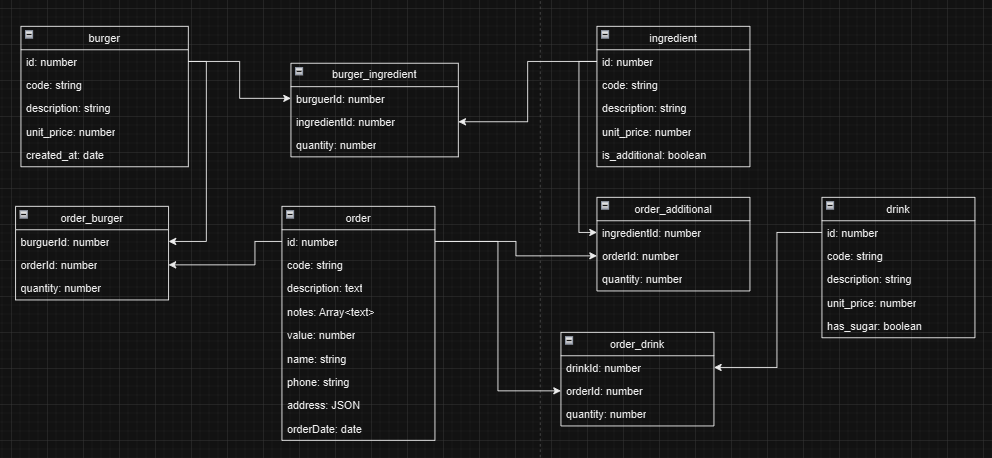

## Descrição

Este é o backend do "Order Manager", um sistema de gerenciamento de pedidos para uma lanchonete (desafio técnico). Ele foi desenvolvido com **Node.js**, com **NestJS** e com **TypeORM** para a interação com o banco de dados **PostgreSQL**. O objetivo deste sistema web é gerenciar pedidos, hambúrgueres, bebidas e ingredientes.

## Tecnologias Utilizadas

- **Node.js**
- **NestJS**
- **TypeORM**
- **PostgreSQL**
- **Docker**

## Pré-requisitos

Para executar este projeto localmente, você precisará de:

- **Node.js** (versão 18 ou superior)
- **Docker** (para criar e executar containeres)
- **npm** ou **yarn** (gerenciador de pacotes)
- **PostgreSQL** instalado ou rodando via Docker

### Com executar a aplicação com Docker

### 1. Clone o Repositório

```bash
git clone https://github.com/natasilva/om-back
cd om-back
```

### 2. Instale as dependências

```bash
npm install
```

### 3. Crie a imagem docker da aplicação

```bash
docker build -t om-back .
```

### 4. Rode os containeres da aplicação e do banco de dados PostgreSQL

```bash
docker-compose up -d
```

### 5. Execute as migrations para criar as tabelas no banco de dados
Aqui as migrations serão executadas por dentro do container da aplicação
```bash
docker-compose exec order-manager-back npm run migrate:prod
```

### Como executar a aplicação sem Docker

Se preferir rodar a aplicação diretamente em sua máquina sem usar Docker, siga as instruções abaixo:

### 1. Criar o arquivo `.env`

Crie um arquivo `.env` na raiz do projeto com as variáveis de configuração do banco de dados (se o banco não estiver executando via docker, substiua o valor das variáveis de ambiente):

```env
TYPEORM_HOST=localhost
TYPEORM_PORT=5432
TYPEORM_USERNAME=postgres
TYPEORM_PASSWORD=p0stgr3s
TYPEORM_DATABASE=order-manager-db
TYPEORM_LOGGING=true
NODE_ENV=development
```

### 2. Instale dependências

```bash
npm install
```

### 3. Execute as migrations
Aqui as migrations serão executadas diretamente (diferentemente do "npm run migrate:prod")
```bash
npm run migrate:dev
```

A modelagem de entidades utilizada foi esta:


